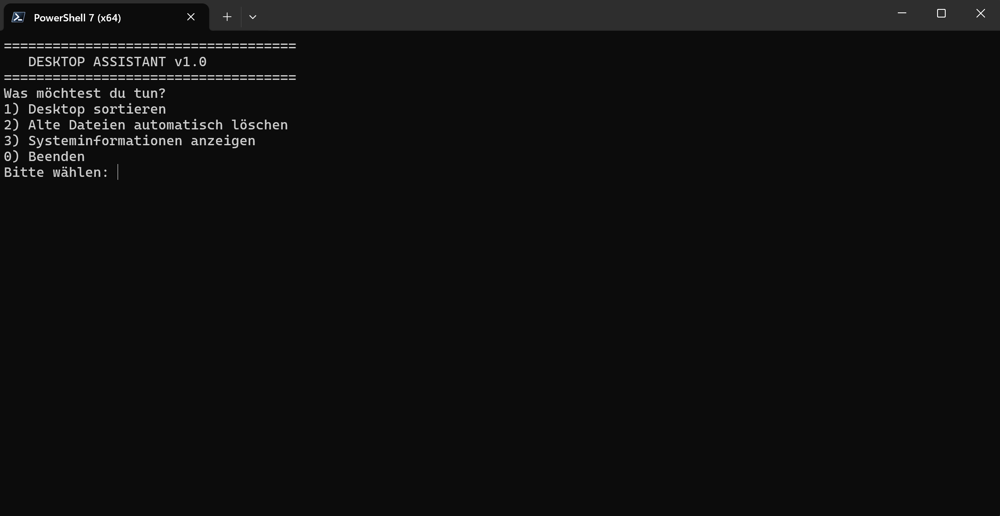
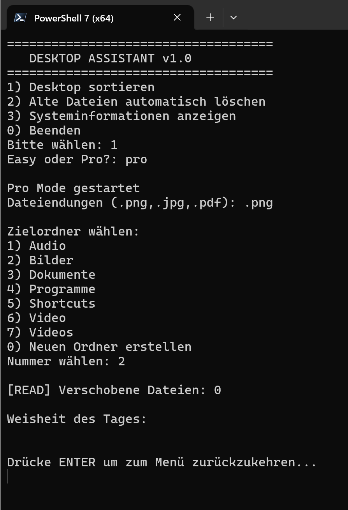
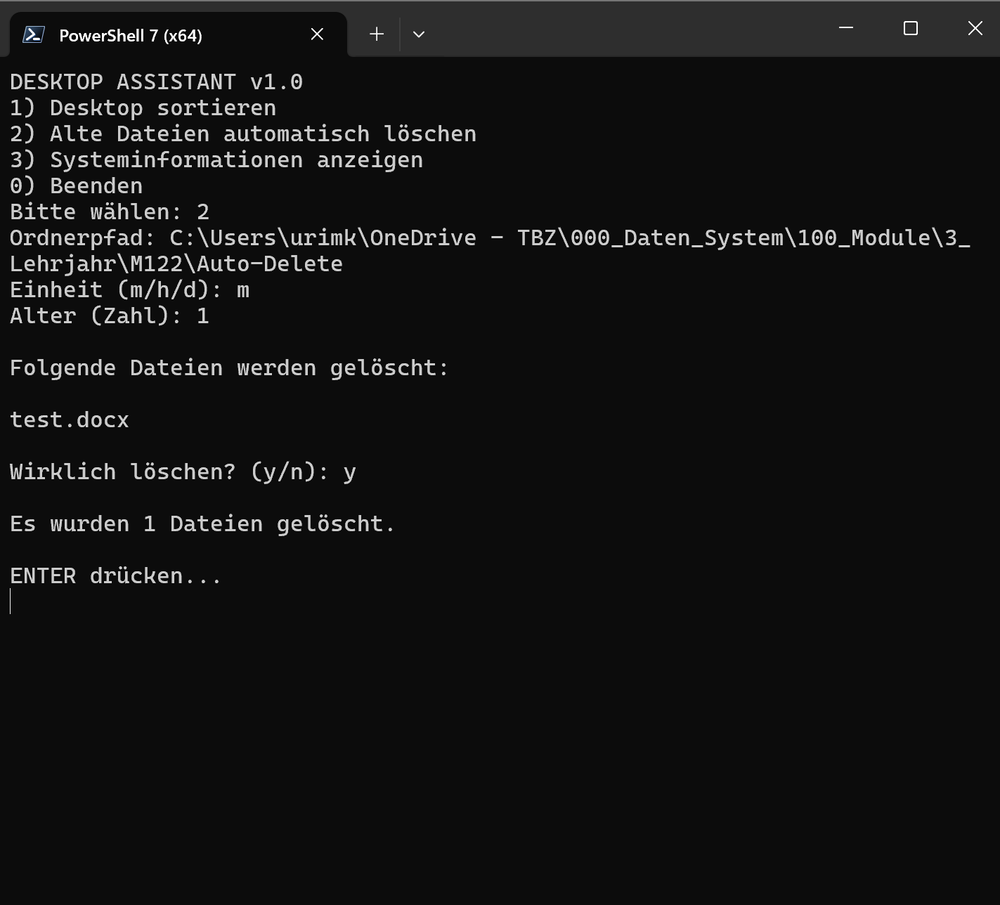

# Desktop Assistant – Benutzeranleitung

Diese Anleitung erklärt kurz, wie das PowerShell‑Script ausgeführt wird und welche Voraussetzungen nötig sind.
Gedacht ist sie als **README.md** für das GitHub‑Repository. Screenshots kannst du später ergänzen.

Diese Dokumentation ist in Zwei teilein aufgeteilt. Einmal **Vorbereitung** und einmal **Ausführung**.


---
# Teil 1 - Vorbereitung
## Voraussetzungen

* **Windows 10 oder Windows 11**
* **PowerShell 7 (x64)** – *empfohlen*

  > Das Script wurde hauptsächlich mit PowerShell 7 (64‑Bit) getestet und wird damit empfohlen.
* Berechtigung, PowerShell‑Skripte auszuführen

### PowerShell 7 installieren (falls nicht vorhanden)

Download: [https://learn.microsoft.com/powershell/](https://learn.microsoft.com/powershell/)

Nach der Installation heisst der Befehl:

```powershell
pwsh
```

---

## Repository klonen oder herunterladen

### Option 1: Git

```bash
git clone https://github.com/<dein-username>/<repository-name>.git
```

### Option 2: ZIP

* Auf **Code → Download ZIP** klicken
* ZIP entpacken

---

## Script ausführen

1. **PowerShell 7 (x64)** öffnen
2. In den Projektordner wechseln:

```powershell
cd "Pfad\zum\Projektordner"
```

3. Falls nötig, Execution Policy für die aktuelle Session setzen:

```powershell
Set-ExecutionPolicy -Scope Process -ExecutionPolicy Bypass
```

4. Script starten:

```powershell
./Desktop-Assistant.ps1
```

*(Dateiname ggf. anpassen)*

---

# Teil 2 - Ausführung

In diesem Teil wird erklärt was das Skript bietet und geht zu jeder Funktion ins Detail was es macht und wie man es zu benutzen hat.

---

## Übersicht der Funktionen

Das Script bietet vier Hauptfunktionen:

1. **Desktop Sorter (Easy Mode)**
2. **Desktop Sorter (Pro Mode)**
3. **Auto Deleter**
4. **Systeminformationen anzeigen**

---
## Script Durchlauf
Beim Ausführen vom Programm kommt man ins Hauptmenü:
Hier wählt man den Gewünschten Modus an indem man die entsprechende **Zahl** eingibt. Mit "0" Kann man das Programm auch beenden.

Ich gehe nicht auf die Funktion 3 ein da sie Ziemlich selbsterklärend ist.

### Desktop Sortieren
Indem man **1** eingibt kann man den Desktop Sortieren lassen.
Man hat dann Zwei Optionen zur verfügung: Easy und Pro

Um den Modus auszuwählen muss man auch schauen das man es ganz ausschreibt und keine Tipp fehler macht (Gross/Kleinschreibung ist irrelevant)

---
#### Easy mode
Der Easy Mode führt das Script einfach aus und benutzt den Sortier Default um eine Grundlegende Ordnerstruktur zu erstellen und Dateien basierend auf dem Dateityp dort hin zu sortieren.

**!!WICHTIG!!:** Wenn eine Datei den gleichen Namen trägt wie eine im Ordner und dorthin verschoben wird, wird die datei die bereits im Ordner war **überschrieben**.

---
#### Pro Mode
Im Pro Mode kann man einen der bereits exestierenden Ordner auswählen oder einen neuen erstellen und dann selbst entscheiden welche Datei endung in welchen Ordner kommt.

Ein ablauf kann wie folgt aussehen:



### Delete Funktion
Vorab weg, der funktionsname "Alte Dateien automatisch löschen" ist etwas irre führend. Es werden lediglich alle dateien einmalig gelöscht die  älter sind als die angegebene Zeit.

Hier wäre ein beispiel wie ein Ablauf aussehen könnte:



# Fazit
Solange man das macht was das Script sagt und wenn optionen nummeriert sind Nummern eingibt oder halt einfach den Buchstaben eingibt wie bei der Bestätigung vom löschen (y/n) sollte es ansicht gut funktioniert.

Weiter Gehts ins detail von jeder Funktion und was sie machen:

---
## 1. Desktop Sorter (Easy Mode)

Der **Easy Mode** ist für schnelle und sichere Desktop-Aufräumaktionen gedacht.

### Was macht der Easy Mode?

* Sortiert Dateien auf dem Desktop automatisch in vordefinierte Ordner
* Erkennt gängige Dateitypen selbstständig
* Überspringt unbekannte Dateien ohne Fehlermeldung

### Typische Sortierung

* Bilder → *Pictures / Images*
* Videos → *Videos*
* Dokumente (PDF, DOCX, XLSX etc.) → *Documents*
* Programme / Verknüpfungen → *Programs*

### Für wen geeignet?

* Anfänger
* Nutzer, die **ohne viele Einstellungen** Ordnung schaffen wollen

---

## 2. Desktop Sorter (Pro Mode)

Der **Pro Mode** bietet maximale Kontrolle über den Sortierprozess.

### Was macht der Pro Mode?

* Sortierung basierend auf **Dateiendungen**
* Benutzer kann selbst festlegen:

  * Welche Endung wohin verschoben wird
  * Welche Dateitypen berücksichtigt werden

### Besonderheiten

* Höhere Flexibilität
* Mehr Verantwortung beim Nutzer


---

## 3. Auto Deleter

Der **Auto Deleter** löscht Dateien automatisch basierend auf ihrem Alter.

### Funktionsweise

* Benutzer wählt einen Ordner aus indem er den Pfad angibt
* Benutzer definiert eine Zeitspanne:

  * Minuten
  * Stunden
  * Tage

* Alle Dateien, die **älter als die festgelegte Zeit** sind, werden gelöscht

### Wichtige Hinweise

* Dateien werden **dauerhaft gelöscht**
* Es erfolgt eine Sicherheitsabfrage vor dem Start
* Empfohlen nur für:

  * Temporäre Ordner
  * Download- oder Cache-Verzeichnisse


---

## 4. Systeminformationen anzeigen

Diese Funktion zeigt grundlegende Systeminformationen an.

### Angezeigte Informationen

* CPU
* Arbeitsspeicher (RAM)
* Grafikkarte (GPU)
* Weitere relevante Systemdaten

### Zweck

* Schneller Überblick über das eigene System
* Nützlich für Diagnose oder Dokumentation

---

## Logging

Alle Aktionen des Scripts werden automatisch protokolliert:

* Logdateien werden **nach Datum benannt**
* Gespeichert in einem Archiv- bzw. Log-Ordner
* Enthalten Informationen über:

  * Ausgeführte Aktionen
  * Anzahl verschobener oder gelöschter Dateien

---

## Allgemeine Hinweise

* Teste neue Funktionen zuerst mit **unwichtigen Dateien**
* Lies Konsolenmeldungen aufmerksam
* Der Benutzer trägt die Verantwortung für durchgeführte Aktionen


---

## Hinweis

Dieses Projekt ist ein **Schulprojekt** und dient Lern‑ und Demonstrationszwecken.

---

*Autor: Urim Krasniqi*
# M122-Project-Desktop_Sorter